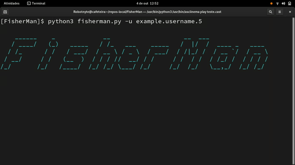
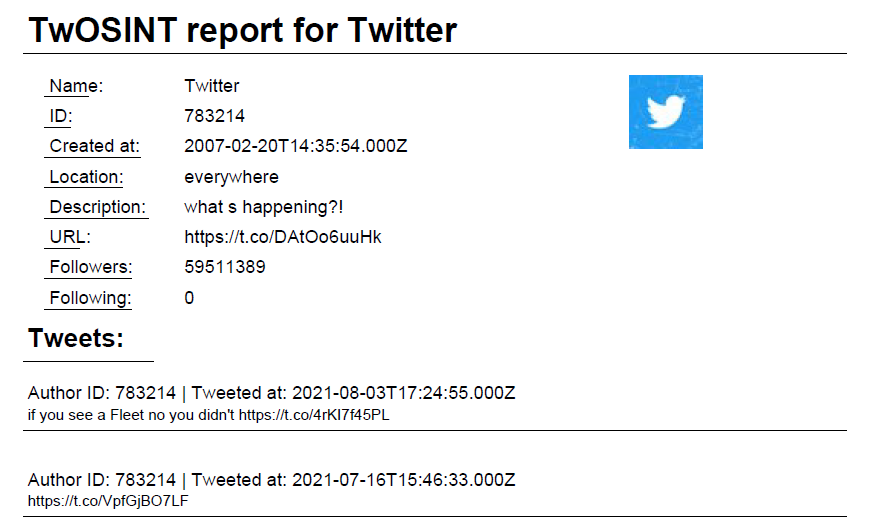

# OSINT investigation (tools)

Like traditional investigations, OSINT investigations involve finding and locating evidence to support your mission goals. 
During an OSINT investigation, analysts will search for crucial data related to their operation in open web spaces, such as online news outlets or social media platforms.

TABLE OF CONTENT

<li><a href="fisherman/#README.md">fisherman</a></li>
<li><a href="twint/#README.md">twint</a></li>
<li><a href="twosintComet/#README.md">tw1tter0s1nt</a></li>
<li><a href="twpy/#README.md">twpy</a></li>
<li><a href="TwOSINT/#README.md">TwOSINT</a></li>

